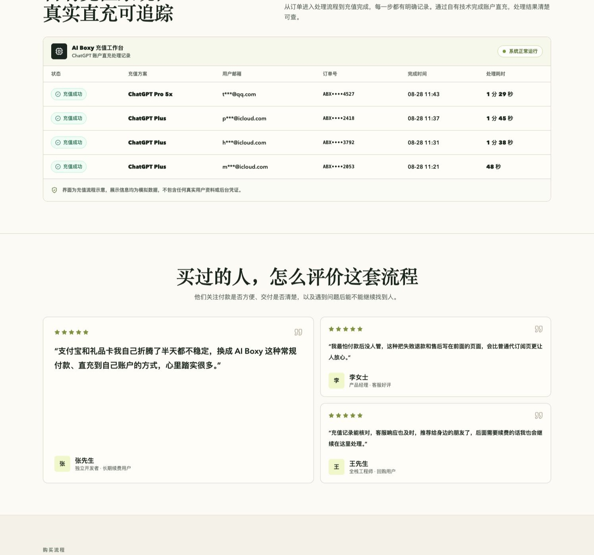

# ChatGPT Plus/Pro Codex 5.6 Sol、Terra、Luna｜代充 充值 完整指南

> 本文更新于 2026 年 8 月 28 日。支付规则、价格和可用地区会变化，下单前请以服务方页面为准。

人在国内，没有海外信用卡，怎么把自己的 ChatGPT 账号升级成 Plus/Pro？目前能走的路径不少，但门槛、成功率和风险差别很大。这篇文章把常见方法放在一起，按自己的设备、支付条件和风险接受程度选择即可。

常见方法包括人民币自助服务、海外信用卡、PayPal、App Store 或 Google Play 礼品卡、虚拟信用卡和共享账号。看起来每条路都能走，真正操作时却各有门槛：有的容易支付失败，有的流程复杂，还有的虽然便宜，却无法保障聊天记录和账号安全。

如果只想先看结论：

- 没有海外卡，又不想折腾：优先考虑支持人民币付款、订单可查询、售后规则清楚的自助服务。
- 有稳定、合规的海外支付方式：优先在 ChatGPT 官方页面直接订阅。
- 熟悉苹果或安卓商店：可以研究对应地区的礼品卡和订阅规则。
- 共享账号：除非只是临时体验且不输入任何隐私内容，否则不建议。

## 方法一：人民币自助服务，目前最省事的选择

### 适合谁？

- 没有海外信用卡；
- 不想研究虚拟卡和账单地址；
- 不想折腾美区 Apple ID 或 Google Play；
- 使用安卓或 Windows，没有苹果设备；
- 临时急用 Plus，希望尽快完成订阅；
- 公司付款，需要保留订单凭证。

自助服务的基本流程是：用人民币购买订阅方案，支付后按页面提示把权益交付到自己的 ChatGPT 账号。选择平台时，重点不是页面写的最低价格，而是价格、订单、交付和售后有没有公开说明。

AI Boxy 是本指南关联的自有服务，购买页会展示当前开放的 ChatGPT 方案、支付方式和处理说明。它不是 OpenAI 官方渠道，具体价格、可用性和售后边界以购买页实时信息为准。

👉 **[查看 AI Boxy 当前方案](https://www.ai2boxy.com/zh/purchase/)**

*AI Boxy 购买页示例，方案、订单和售后信息以页面实时内容为准。*

### 选择自助服务时看什么？

- 是否有明确的商品价格和操作步骤；
- 是否支持订单查询，支付后能否找到交付信息；
- 是否公开退款、失败处理和售后规则；
- 是否有能联系到人工客服的入口；
- 是否要求把账号密码或验证码交给客服；
- 是否持续维护网站，而不是临时收款页面。

### 优点

- **操作省事：** 不用申请虚拟卡，也不用切换 App Store 地区。
- **国内支付友好：** 按页面支持的人民币方式付款。
- **不挑设备：** 完成订阅后按 ChatGPT 账号状态使用。
- **订单可追踪：** 支付、交付和售后围绕订单号继续处理。
- **客服响应及时：** 遇到支付、交付或账号状态异常时，可以联系 AI Boxy 在线客服，客服会结合订单号及时回复并继续跟进处理。

### 缺点与注意事项

- **依赖第三方服务：** 稳定性不能等同于 ChatGPT 官网直付。
- **价格可能变化：** 汇率、库存和渠道成本都会影响最终价格，以下单页为准。
- **不要囤购：** 服务规则或可用地区变化后，长期囤购可能增加损失。
- **不要交出密码：** 任何要求长期登录凭证的流程都要先停下来核对。

## 方法二：海外信用卡直付，官方渠道最直接

如果你有海外发行的 Visa、Mastercard 或 American Express，可以直接在 ChatGPT 官方页面订阅。账单、续费、取消和账号支持都由自己管理，这是账号掌控力最高的路径。

国内发行的双币卡不代表一定能通过。支付是否成功会受到发卡地区、账单资料、账号地区和实时风控影响。使用自己的银行卡给 Plus 或 Pro 付款时，比较常见的问题就是卡片触发支付风控，扣款被拒，或者首次付款成功但后续续费失败。

出现被拒时，不一定是卡里没钱，也可能是发卡行拦截、卡段不被Stripe接受、账单地址不匹配，或支付平台判断交易风险较高。不要短时间连续反复提交同一张卡，否则可能进一步触发卡片或账号侧的风控。

### 优点与限制

- 优点：订阅关系最直接，账号完全由自己控制。
- 限制：需要合适的卡和账单资料，遇到卡片风控、扣款被拒或续费失败时，千万不要频繁尝试。

## 方法三：PayPal 或其他外币支付

如果 PayPal 已经绑定可用的外币卡，可以尝试在官方订阅页面付款。国内注册的 PayPal 如果只绑定银联卡，通常不能绕过海外支付门槛，因此这条路并不适合所有人。

使用第三方支付时，先确认收款主体、币种、退款条件和自动扣款设置。不要为了测试支付，把大量余额长期留在陌生账户里。

## 方法四：App Store 或 Google Play 礼品卡

### 苹果用户

需要符合条件的 Apple ID、对应地区的礼品卡或外币支付方式，以及官方 ChatGPT App。礼品卡地区必须和 Apple 账户地区匹配，主账户已有订阅或余额时，不要贸然切换地区。

### 安卓用户

Google Play 路径同样受账号地区、礼品卡来源和应用可用性影响。注册、充值和后续续费比网页直付多几步，开始前先确认自己的账户是否满足条件。

**提醒：** 礼品卡不是万能解法，溢价、地区限制和余额退款规则都要在购买前核对。

## 方法五：虚拟信用卡 VCC，适合愿意自己折腾的人

虚拟卡看起来门槛低，但支付风控、卡段可用性和余额取回都存在不确定性。开卡费、充值费和月费也会增加真实成本。

- 支付被拒是常见情况，反复试卡可能触发额外风控；
- 平台停止服务或冻结卡片后，余额处理可能很麻烦；
- 卡片能完成一次付款，不代表自动续费可以长期运行；
- 除非熟悉发卡平台和国际支付规则，否则不建议把它作为第一选择。

## 方法六：低价共享账号，便宜但不建议

共享账号的操作最简单：付款后，卖家提供一组邮箱和密码，多个人登录同一个 Plus 账号。它唯一明显的优势是价格低，但问题也很直接：

- 其他人可能看到你的聊天记录；
- 上传的代码、文档和图片可能泄露；
- 卖家随时可以修改密码；
- 多人异地登录容易触发验证或限制；
- 账号失效后很难追责。

如果只是临时查看 Plus 界面，而且完全不输入任何隐私内容，可以自行权衡。只要涉及工作资料、学习资料、简历、合同、代码或个人信息，就不要使用共享账号。

## 六种方式怎么选？

| 方式 | 操作难度 | 账号掌控 | 主要成本 | 适合人群 | 建议 |
| --- | --- | --- | --- | --- | --- |
| 人民币自助服务 | 低 | 自己的账号 | 人民币套餐价 | 没有海外卡、想省事 | 先看清规则 |
| 海外信用卡 | 高 | 自己的账号 | 官方套餐价和可能的税费 | 有稳定海外支付方式 | 有卡首选 |
| PayPal | 中高 | 自己的账号 | 需要可用外币卡 | 已有 PayPal 的用户 | 有条件可试 |
| App Store / Google Play | 中 | 自己的账号 | 礼品卡溢价和地区限制 | 熟悉商店规则的人 | 谨慎研究 |
| 虚拟信用卡 | 中 | 自己的账号 | 开卡、充值和风控成本 | 熟悉国际支付的人 | 谨慎尝试 |
| 共享账号 | 低 | 不掌控账号 | 通常最低 | 无隐私的临时测试 | 不推荐 |

## 充值前后的安全检查

1. 只在自己登录的账号和可信页面操作，不要把 ChatGPT 密码、验证码交给任何人。
2. 保存订单号、付款截图和服务说明，付款前先确认退款边界。
3. 充值完成后回到 ChatGPT 的账户或套餐页面，确认 Plus 状态真的生效。
4. 不要在非官方页面输入 API Key，也不要把长期有效的登录凭证发给客服。

## 常见问题

### 国内没有海外信用卡，怎么订阅 ChatGPT Plus？

可以先研究 App Store、Google Play 或人民币自助服务。选择第三方服务时，重点核对订单查询、交付流程、退款规则和客服入口。

### 订阅需要把 ChatGPT 密码给客服吗？

不应该。任何要求你交出密码或验证码的流程都要先停下来核对必要性和服务方身份。

### ChatGPT Plus 包含 API 额度吗？

不包含。ChatGPT Plus 和 OpenAI API 是两套独立的产品与计费体系。

### 已有 Plus 还能继续充值吗？

先确认当前订阅的到期时间和服务方规则。重复购买、覆盖订阅或选错账号时，剩余时间不一定顺延。

## 更多专题教程

- [国内怎么订阅 ChatGPT Plus：四种方式说明](articles/chatgpt-plus-recharge.html)
- [海外卡、礼品卡和自助服务：支付方式对比](articles/payment-options.html)
- [ChatGPT 订阅时如何保护账号](articles/account-safety.html)

## 总结

国内订阅 ChatGPT Plus，真正实用的判断标准不是哪家价格最低，而是账号是不是自己的、付款后能不能查询订单、失败后有没有售后、整个流程是否清楚透明。

- 有合规可用的海外支付方式，优先选择官网直付；
- 熟悉商店规则，可以考虑 App Store 或 Google Play；
- 没有海外卡、不想研究虚拟卡，可以考虑规则清楚的人民币自助服务；
- 不要把账号密码、验证码或敏感 Session 交给任何人，也不要使用共享账号处理隐私内容。

👉 **[查看 AI Boxy 当前订阅方案](https://www.ai2boxy.com/zh/purchase/)**

> 内容说明：本文用于信息整理，不代表 OpenAI、Anthropic 或 Apple。ChatGPT、Claude 和 Apple 是其各自权利人的商标。服务可用性、价格和政策可能变化，请以官方或服务提供方的最新页面为准。
